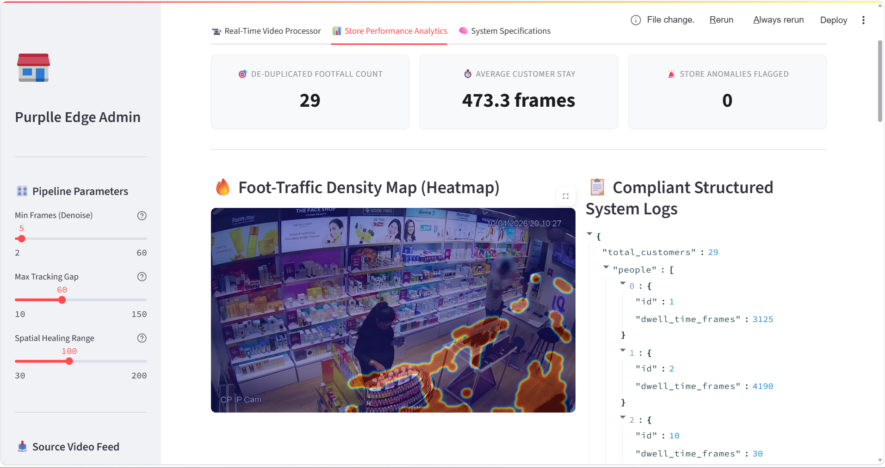
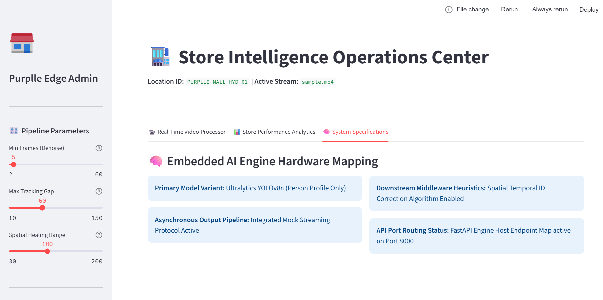
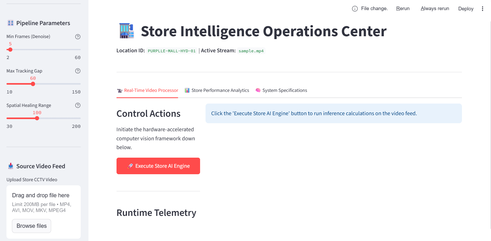
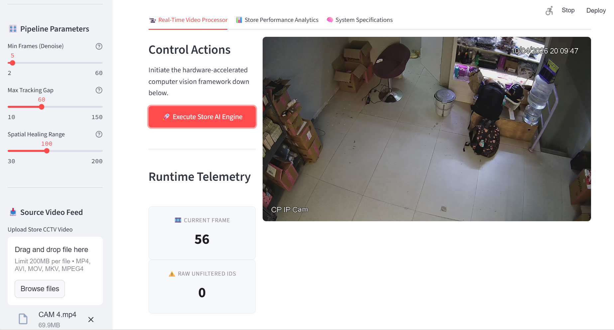

# Purplle Store Intelligence System

A store analytics platform for real-time video processing, customer tracking, and performance monitoring using YOLOv8, FastAPI, Streamlit, and custom tracking logic.

## Results









## Project structure

- `app.py` - application entrypoint
- `api/server.py` - FastAPI REST API server
- `pipeline/` - video detection, tracking, heatmap, and streaming scripts
- `schema/events_schema.py` - event schema and payload definitions
- `requirements.txt` - Python dependency manifest
- `data/videos/` - source video assets (ignored by git)
- `output/` - generated outputs and logs (ignored by git)
- `yolov8n.pt` - model weights (ignored by git)

## Features

- real-time video object detection and tracking
- de-duplicated customer footfall analytics
- heatmap generation for density mapping
- structured telemetry and event logging
- REST API and dashboard-ready interface

## Setup

```bash
pip install -r requirements.txt
```

## Run

```bash
python app.py
```

## Notes

- Ensure your video files are stored in `data/videos/` but not committed to git.
